# Society Connect

## Description:
 Society Connect is a Django-based web application designed to simplify residential society management through features like admin approval workflow, CAPTCHA-based authentication, email notifications, complaint management, notices, events, services, maintenance modules, and an analytical dashboard for complaint tracking.

## Features:
- Admin Approval Workflow
- CAPTCHA-based Login System
- Email Notification System
- Complaint Management Module
- Notice & Event Management
- Maintenance Tracking
- Society Services Module
- Complaint Analytics Dashboard
- Role-based Access

## Tech Stack:

- Python
- Django
- SQLite / MySQL
- HTML
- CSS
- JavaScript
- Bootstrap

## Screenshots:

## Landing Page

### Homepage
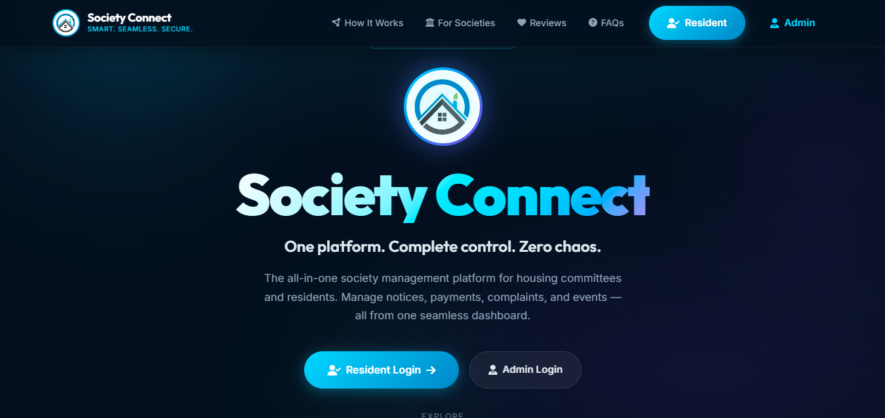

## User Panel

### User Login
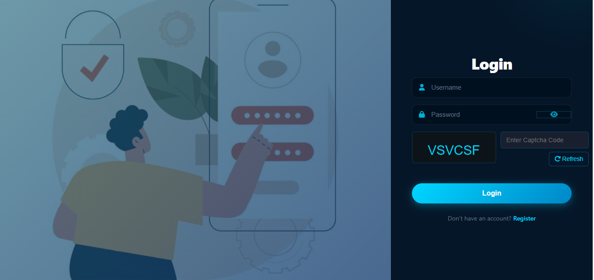

### User Registration Request
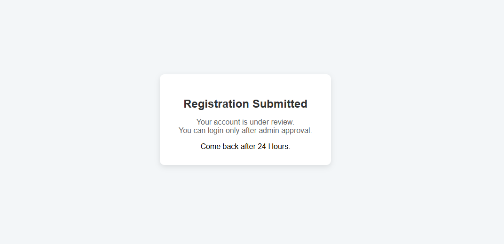

### User Complaint Module
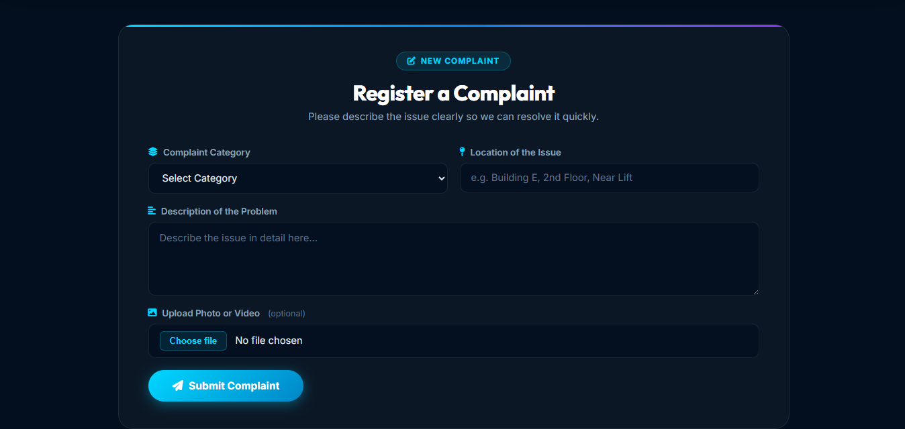

### User Maintenance Module
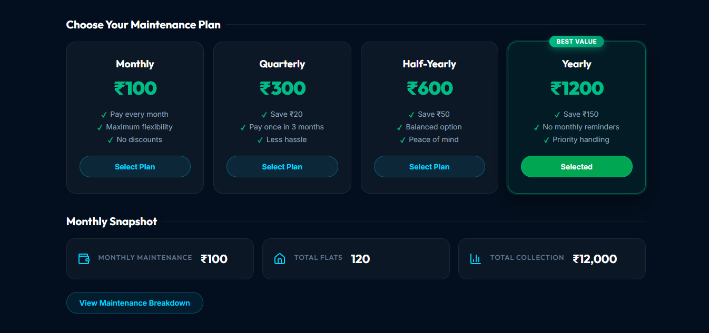

### User Maintenance Payment
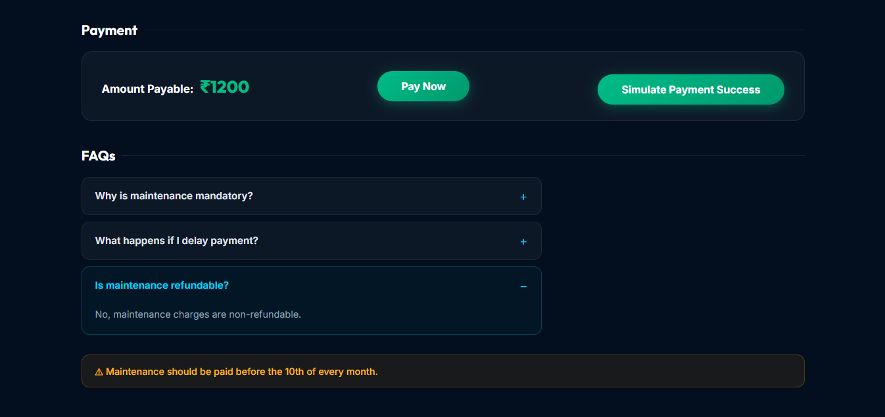

### User Notices & Updates
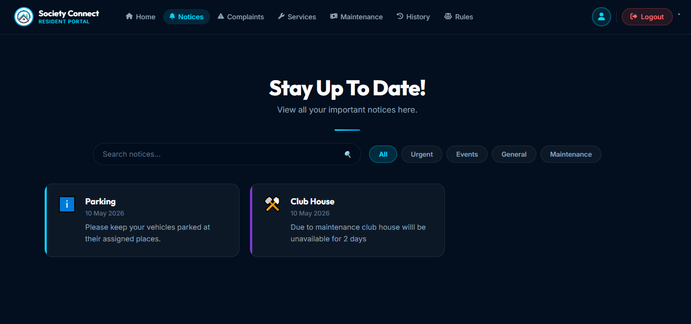

## Admin Panel

### Admin Login
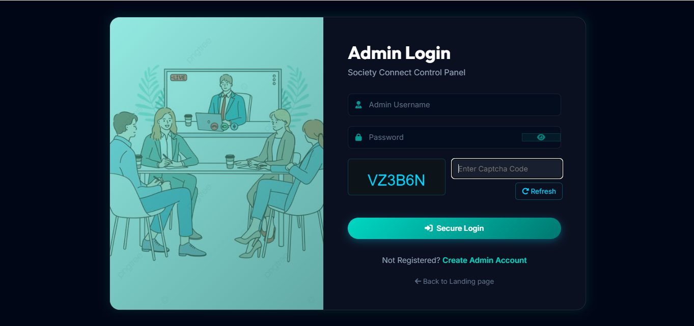

### Complaint Management
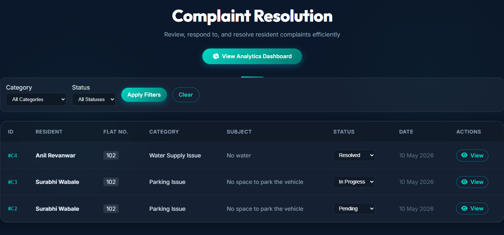

### Complaint Dashboard
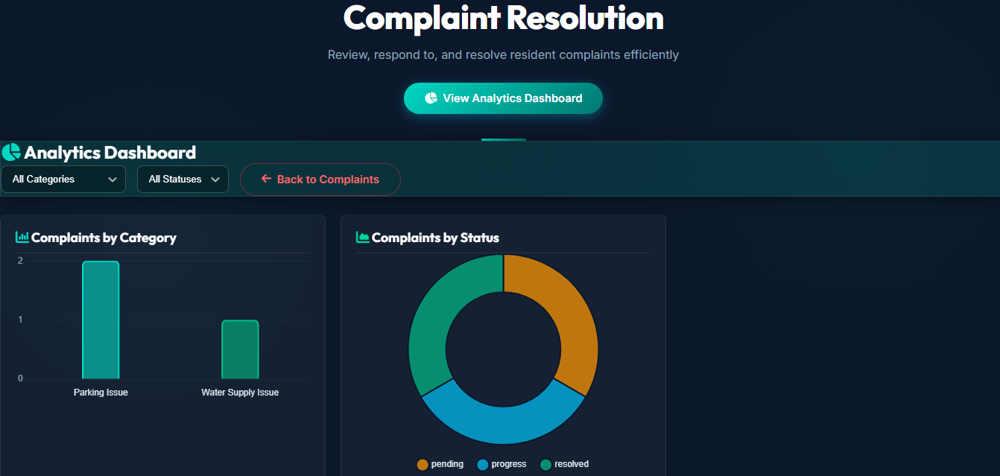

### User Approval Workflow
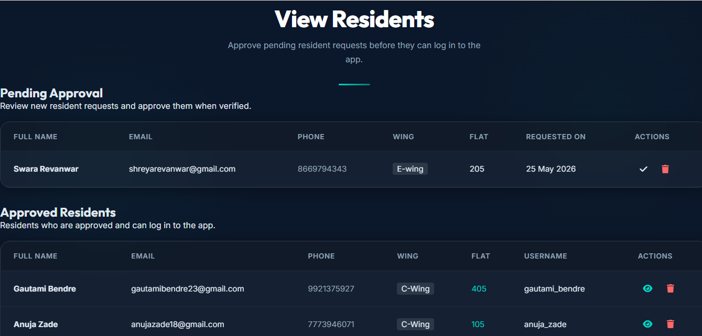

### Notice Management
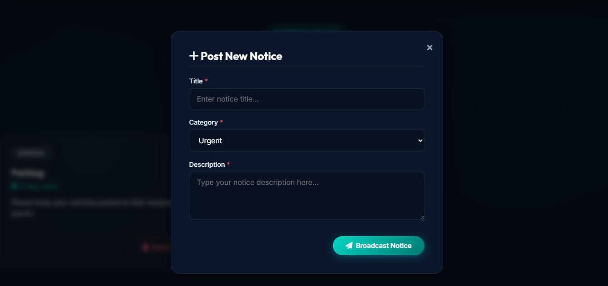

### Services Management
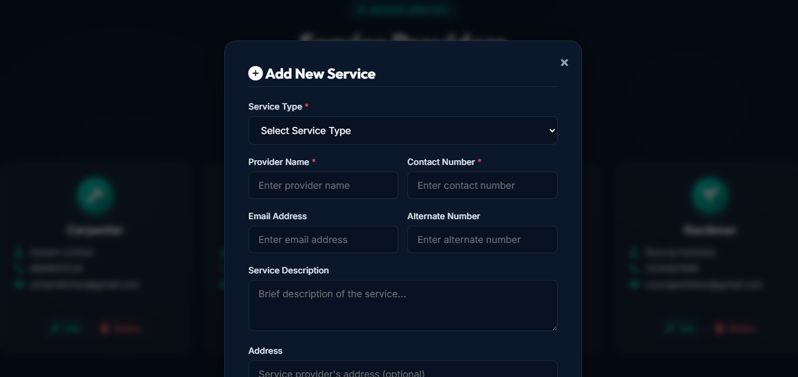

## Installation Guide

### 1. Clone the Repository

```bash
git clone https://github.com/ShreyaRevanwar/Society_Connect.git
```

---

### 2. Navigate to Project Directory

```bash
cd Society_Connect
```

---

### 3. Create Virtual Environment

```bash
python -m venv myVenv
```

---

### 4. Activate Virtual Environment

### Windows

```bash
myVenv\Scripts\activate
```

---

### 5. Install Required Dependencies

```bash
pip install -r requirements.txt
```

---

### 6. Apply Database Migrations

```bash
python manage.py makemigrations
```

```bash
python manage.py migrate
```

---

### 7. Create Superuser

```bash
python manage.py createsuperuser
```

Enter:
- username
- email
- password

After creating the superuser, log in to the superadmin and update the account status from `Pending` to `Approved` for the required admin/user accounts.

---

## 8. Check Project for Errors

```bash
python manage.py check
```

---

## 9. Run Development Server

```bash
python manage.py runserver
```

---

## 10. Open in Browser

```txt
http://127.0.0.1:8000/
```

---

# Default Workflow

1. User submits registration request
2. Admin approves User accounts
3. Approved users can log into the system
4. Users can access complaint, notice, maintenance,rules and service modules